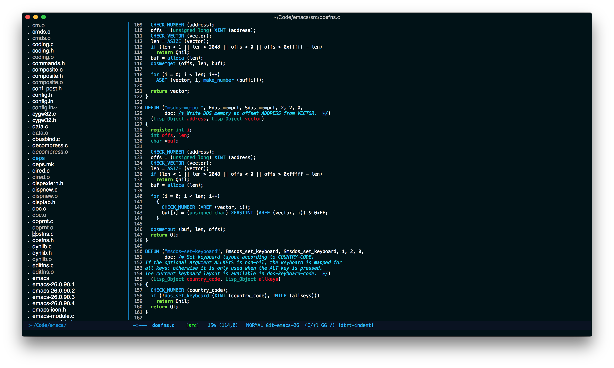
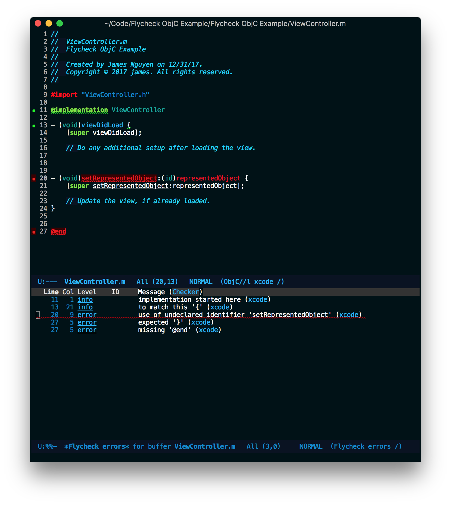

#+TITLE: Fruity Theme

* About
  A port of Vim's Fruity Theme.
  https://github.com/mitsuhiko/fruity-vim-colorscheme

* Installation

  #+begin_src emacs-lisp :tangle yes
(use-package fruity-theme
  :vc (:url "https://github.com/jojojames/fruity-theme")
  :config
  (load-theme 'fruity t))
  #+end_src

or

  Install manually by git cloning and then adding to ~custom-theme-load-path~.

  #+begin_src emacs-lisp :tangle yes
  (load-theme 'fruity t)
  #+end_src

* Screenshots
  
  
